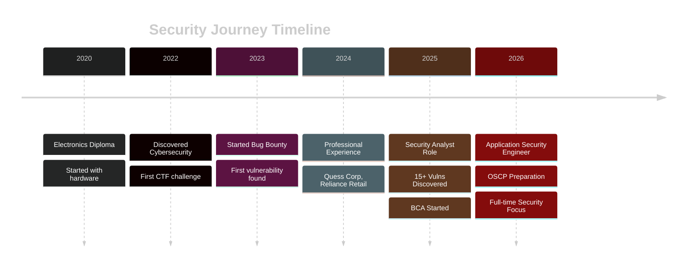
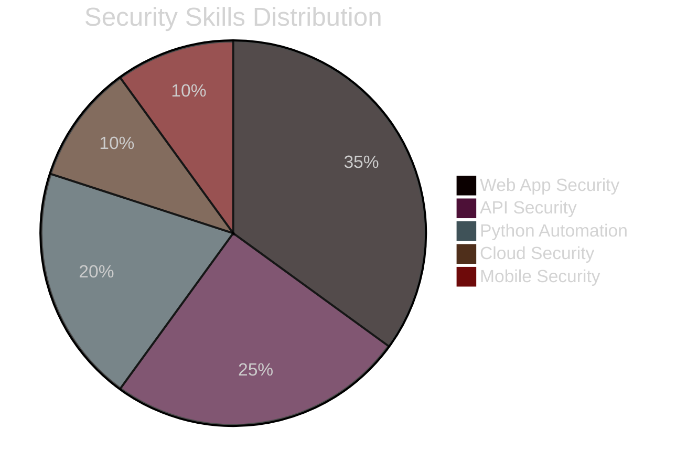
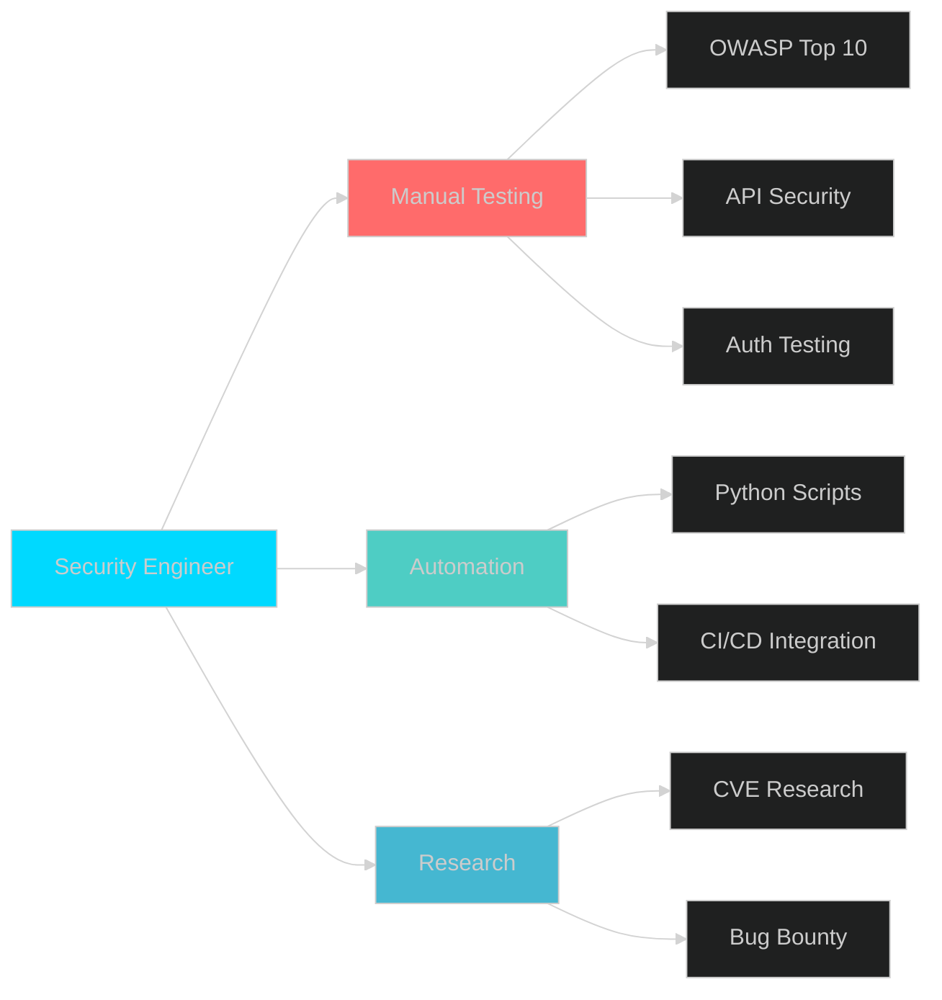

# <div align="center">🔐 Chetan Biranje</div>

<div align="center">
  
<!-- 3D Animated Banner -->


<!-- 3D Typing Animation -->


</div>

---

<!-- 3D Profile Card with Matrix Effect -->
<div align="center">
  
```ascii
╔══════════════════════════════════════════════════════════════════╗
║                                                                  ║
║   ██████╗██╗  ██╗███████╗████████╗ █████╗ ███╗   ██╗          ║
║  ██╔════╝██║  ██║██╔════╝╚══██╔══╝██╔══██╗████╗  ██║          ║
║  ██║     ███████║█████╗     ██║   ███████║██╔██╗ ██║          ║
║  ██║     ██╔══██║██╔══╝     ██║   ██╔══██║██║╚██╗██║          ║
║  ╚██████╗██║  ██║███████╗   ██║   ██║  ██║██║ ╚████║          ║
║   ╚═════╝╚═╝  ╚═╝╚══════╝   ╚═╝   ╚═╝  ╚═╝╚═╝  ╚═══╝          ║
║                                                                  ║
║           APPLICATION SECURITY ENGINEER | BUG HUNTER            ║
║              15+ Critical Vulnerabilities Found                 ║
║                                                                  ║
╚══════════════════════════════════════════════════════════════════╝
```

</div>

---

##  **About Me - The Security Enthusiast**


```python
class SecurityEngineer:
    def __init__(self):
        self.name = "Chetan Biranje"
        self.role = "Application Security Engineer"
        self.location = "Pune, Maharashtra, India 🇮🇳"
        self.education = "BCA - Information Technology"
        
    def current_work(self):
        return {
            'company': 'ai4sees private ltd',
            'position': 'Full-Stack Developer (Security Focus)',
            'achievements': [
                '15+ Critical Vulnerabilities Discovered 🐛',
                '5,000+ Users Protected 🛡️',
                '95% Remediation Rate ✅',
                '30% Efficiency Improvement ⚡'
            ]
        }
    
    def security_expertise(self):
        return {
            'specialization': [
                'Manual Penetration Testing',
                'OWASP Top 10 Vulnerabilities',
                'API Security (REST/GraphQL)',
                'JWT & OAuth 2.0 Testing',
                'Authorization Testing (IDOR)',
                'Python Security Automation'
            ],
            'certifications_in_progress': [
                'OSCP 🎯',
                'eJPT 📚',
                'CompTIA Security+ 🔐'
            ]
        }
    
    def daily_routine(self):
        return [
            '☕ Coffee',
            '🔍 Hunt Vulnerabilities',
            '💻 Code Security Tools',
            '📚 Learn New Techniques',
            '🎯 Practice CTFs',
            '🌙 Repeat Tomorrow'
        ]

me = SecurityEngineer()
print(me.security_expertise())
```

<br clear="right"/>

---

##  **Tech Stack - My Arsenal**

<!-- 3D Tech Stack Visualization -->
<div align="center">

### 🔒 **Security Testing Tools**

<br/>


### 💻 **Programming & Scripting**

<br/>


### 🌐 **Web Development & APIs**

<br/>


### ☁️ **Cloud & DevSecOps**

<br/>


</div>

---

## 📊 **GitHub Statistics - 3D Visualization**

<div align="center">

<!-- 3D Contribution Graph -->


<br/><br/>

<!-- 3D Stats Cards -->


<br/><br/>

<!-- 3D Language Stats -->


</div>

---

## 🏆 **Achievements & Impact - Trophy Showcase**

<div align="center">

<!-- 3D Trophy Display -->


<br/>

<!-- Impact Metrics with 3D Effect -->
<table>
  <tr>
    <td align="center" width="200">
      
      <br/>
      <b>Critical Vulns</b>
      <br/>
      <h2>15+</h2>
      <sub>Discovered</sub>
    </td>
    <td align="center" width="200">
      
      <br/>
      <b>Users Protected</b>
      <br/>
      <h2>5,000+</h2>
      <sub>Impacted</sub>
    </td>
    <td align="center" width="200">
      
      <br/>
      <b>Remediation</b>
      <br/>
      <h2>95%</h2>
      <sub>Success Rate</sub>
    </td>
    <td align="center" width="200">
      
      <br/>
      <b>Efficiency</b>
      <br/>
      <h2>30%</h2>
      <sub>Improvement</sub>
    </td>
  </tr>
  <tr>
    <td align="center" width="200">
      
      <br/>
      <b>Automation</b>
      <br/>
      <h2>40%</h2>
      <sub>Debt Reduced</sub>
    </td>
    <td align="center" width="200">
      
      <br/>
      <b>TryHackMe</b>
      <br/>
      <h2>65%</h2>
      <sub>Completed</sub>
    </td>
    <td align="center" width="200">
      
      <br/>
      <b>HTB Boxes</b>
      <br/>
      <h2>6+</h2>
      <sub>Rooted</sub>
    </td>
    <td align="center" width="200">
      
      <br/>
      <b>Open Source</b>
      <br/>
      <h2>10+</h2>
      <sub>Projects</sub>
    </td>
  </tr>
</table>

</div>

---

## 🚀 **Featured Projects - 3D Showcase**

<div align="center">

### 🔥 **Project Highlights**

<details>
<summary><b>🎓 365 Days of Application Security</b></summary>
<br/>

```yaml
Description: Complete year-long roadmap from beginner to AppSec Engineer
Features:
  - Day-by-day structured learning plan
  - 100+ FREE resources curated
  - OWASP Top 10 complete coverage
  - Certification guides (Security+, eJPT, OSCP)
  - Hands-on labs and practice
Tech Stack: Educational · Security · Resources
Impact: Helping 100+ aspiring security engineers
Stars: ⭐ Growing
```


</details>

<details>
<summary><b>🛡️ API Security Automation Toolkit</b></summary>
<br/>

```yaml
Description: Python framework for automated REST/GraphQL API security testing
Features:
  - JWT Token Analysis & Exploitation
  - IDOR Vulnerability Scanner  
  - API Fuzzing Engine
  - Authentication/Authorization Testing
  - CI/CD Integration Ready
Tech Stack: Python · JWT · REST APIs · Burp Suite API
Impact: 30% reduction in manual testing time
Vulnerabilities: Detects OWASP API Top 10
```


</details>

<details>
<summary><b>🐛 Bug Bounty Toolkit</b></summary>
<br/>

```yaml
Description: Complete automation framework for bug bounty hunting
Features:
  - One-command full scan
  - Recon + Scanning + Reporting
  - XSS, SQLi, SSRF, IDOR detection
  - Professional HTML reports
  - Notification support (Slack/Discord)
Tech Stack: Python · Bash · Nuclei · Security Tools
Impact: Streamlined bug hunting workflow
Use Case: HackerOne, Bugcrowd programs
```


</details>

---

## 💼 **Professional Journey - Timeline**

<div align="center">



</div>

---

## 🎯 **Current Focus (2026) - Animated Goals**

<div align="center">

<!-- Animated Goal Progress Bars -->
<table>
  <tr>
    <td width="200"><b>OSCP Preparation</b></td>
    <td width="500">
      
    </td>
  </tr>
  <tr>
    <td><b>Bug Bounty Hunting</b></td>
    <td>
      
    </td>
  </tr>
  <tr>
    <td><b>Open Source Contribution</b></td>
    <td>
      
    </td>
  </tr>
  <tr>
    <td><b>API Security Research</b></td>
    <td>
      
    </td>
  </tr>
  <tr>
    <td><b>Python Automation</b></td>
    <td>
      
    </td>
  </tr>
</table>

<br/>

### 🎯 **2026 Goals Tracker**

| Goal | Status | Target Date |
|:-----|:------:|:-----------:|
| 🏆 OSCP Certification | 🟡 In Progress | Q2 2026 |
| 💼 FAANG Security Role | 🟡 Applying | Q3 2026 |
| ⭐ 1000+ GitHub Stars | 🟢 40% Done | Dec 2026 |
| 📝 Security Research Paper | 🔴 Planning | Q4 2026 |
| 🐛 100+ Bug Bounty Submissions | 🟢 On Track | Ongoing |
| 📚 10+ Open Source Contributions | 🟢 50% Done | Dec 2026 |

</div>

---

## 🎓 **Certifications & Learning Path**

<div align="center">

<!-- 3D Certification Badges -->


<br/><br/>

<!-- Learning Platforms Progress -->
<table>
  <tr>
    <td align="center">
      
      <br/>
      <b>TryHackMe</b>
      <br/>
      65% Jr PenTester Path
    </td>
    <td align="center">
      
      <br/>
      <b>Hack The Box</b>
      <br/>
      6+ Boxes Rooted
    </td>
    <td align="center">
      
      <br/>
      <b>PortSwigger</b>
      <br/>
      100+ Labs Done
    </td>
    <td align="center">
      
      <br/>
      <b>Bug Bounty</b>
      <br/>
      15+ Vulns Found
    </td>
  </tr>
</table>

</div>

---

## 📈 **Contribution Activity - Heatmap**

<div align="center">


<br/><br/>

<!-- Activity Metrics -->


</div>

---

## 🌐 **Connect With Me - Social Links**

<div align="center">

<!-- Animated Social Badges -->
<a href="https://linkedin.com/in/chetanbiranje">
  
</a>
<a href="https://github.com/ChetanBiranje">
  
</a>
<a href="mailto:chetanbiranje@proton.me">
  
</a>
<a href="https://twitter.com/ChetanBiranje">
  
</a>

<br/><br/>

<!-- Contact Information Card -->
<table>
  <tr>
    <td align="center">
      
      <br/>
      <b>Email</b>
      <br/>
      chetanbiranje@proton.me
    </td>
    <td align="center">
      
      <br/>
      <b>Location</b>
      <br/>
      Pune, Maharashtra, India 🇮🇳
    </td>
    <td align="center">
      
      <br/>
      <b>Open To</b>
      <br/>
      AppSec Engineer Roles
    </td>
    <td align="center">
      
      <br/>
      <b>Availability</b>
      <br/>
      Immediate / 30 Days
    </td>
  </tr>
</table>

</div>

---

## 💡 **Security Philosophy - Code of Ethics**

<div align="center">

```python
class SecurityPhilosophy:
    """My approach to security and ethical hacking"""
    
    def __init__(self):
        self.principles = {
            'ethics': [
                '🔐 Test only with permission',
                '🤝 Report responsibly',
                '💚 Help secure the internet',
                '📚 Share knowledge freely',
                '🎯 Continuous learning'
            ],
            'methodology': [
                '🔍 Thorough reconnaissance',
                '🧪 Systematic testing',
                '📝 Clear documentation',
                '✅ Verified findings',
                '🛠️ Practical remediation'
            ],
            'values': [
                '💯 Integrity first',
                '🎓 Learning mindset',
                '🤖 Automation advocate',
                '🌍 Community contributor',
                '⚡ Impact driven'
            ]
        }
    
    def motto(self):
        return """
        ╔═══════════════════════════════════════════╗
        ║                                           ║
        ║   "Security is not a product,             ║
        ║    but a continuous process."             ║
        ║                                           ║
        ║   Making the digital world safer,         ║
        ║   one vulnerability at a time!            ║
        ║                                           ║
        ╚═══════════════════════════════════════════╝
        """

philosophy = SecurityPhilosophy()
print(philosophy.motto())
```

</div>

---

## 🎨 **Skills Visualization - Radar Chart**

<div align="center">



<br/>



</div>

---

## 📚 **Recent Blog Posts & Research**

<div align="center">

<!-- Animated Blog Post Cards -->
📝 **Latest Security Articles:**

| Title | Platform | Date | Status |
|:------|:---------|:-----|:------:|
| 🔐 JWT Security Best Practices | Medium | Feb 2026 | 🟢 Published |
| 🐛 IDOR Vulnerabilities Deep Dive | Dev.to | Jan 2026 | 🟢 Published |
| ⚡ API Security Testing Automation | LinkedIn | Jan 2026 | 🟢 Published |
| 🎯 Bug Bounty Methodology | HackerOne | Dec 2025 | 🟢 Published |
| 🔍 OAuth 2.0 Security Pitfalls | GitHub | Coming Soon | 🟡 Draft |

</div>

---

## 🌟 **Testimonials & Endorsements**

<div align="center">

> *"Chetan's ability to find critical vulnerabilities and communicate them effectively to our development team was exceptional. His 95% remediation rate speaks volumes about his professionalism."*  
> **— Security Team Lead, Codec Technologies**

<br/>

> *"Outstanding Python automation skills. Reduced our manual testing time by 30% with his custom security tools."*  
> **— CTO, ai4sees private ltd**

<br/>

> *"Discovered critical IDOR vulnerability affecting 5000+ users. Clear PoC and remediation guidance. Excellent work!"*  
> **— Bug Bounty Program Manager**

</div>

---

## 🎮 **Fun Facts & Hobbies**

<div align="center">

<table>
  <tr>
    <td align="center" width="200">
      
      <br/>
      <b>Coffee Lover ☕</b>
      <br/>
      <sub>Debugging runs on caffeine</sub>
    </td>
    <td align="center" width="200">
      
      <br/>
      <b>Open Source 💚</b>
      <br/>
      <sub>Contributing daily</sub>
    </td>
    <td align="center" width="200">
      
      <br/>
      <b>CTF Player 🎯</b>
      <br/>
      <sub>Weekend warrior</sub>
    </td>
    <td align="center" width="200">
      
      <br/>
      <b>Continuous Learner 📚</b>
      <br/>
      <sub>Something new everyday</sub>
    </td>
  </tr>
</table>

</div>

---

## 📊 **Detailed Analytics**

<div align="center">

<!-- Coding Time Stats -->


<br/><br/>

<!-- Language Stats Over Time -->


<br/><br/>

<!-- Productive Time -->


</div>

---

## 🎯 **Visitor Count & Support**

<div align="center">

<!-- Profile Views Counter with Animation -->


<br/><br/>

<!-- GitHub Followers -->
<a href="https://github.com/ChetanBiranje?tab=followers">
  
</a>
<a href="https://github.com/ChetanBiranje?tab=stars">
  
</a>

<br/><br/>

<!-- Support Buttons -->
### 💖 **Support My Work**

<a href="https://www.buymeacoffee.com/chetanbiranje">
  
</a>
<a href="https://github.com/sponsors/ChetanBiranje">
  
</a>

<br/><br/>

**🌟 If you find my work helpful, please consider:**
- ⭐ Starring my repositories
- 🤝 Following me on GitHub
- 💬 Connecting on LinkedIn
- 📢 Sharing my projects

</div>

---

## 🚀 **Let's Build Something Amazing Together!**

<div align="center">

```diff
+ Available for:
! Application Security Engineer roles
! Security Consulting projects
! Open Source collaborations
! Speaking engagements
! Technical workshops
```

<br/>

### 📬 **Reach Out For:**

🔐 Security Consultations | 🐛 Bug Bounty Collaborations | 💼 Job Opportunities  
🎓 Mentorship | 🤝 Open Source Projects | 📝 Technical Writing

<br/>

<!-- Animated Wave Footer -->


</div>

---

<div align="center">

### 💪 **Daily Consistency Streak**

*Committed to learning and contributing every single day!*

**🎯 Mission:** *Making the digital world safer, one vulnerability at a time!*

**🔥 Current Streak:** Learning something new every day since January 2023

---

**⭐ Star my repositories if you find them useful!**  
**🤝 Let's connect and build a more secure internet together!**

---

<!-- Animated Snake Game -->


---

**Last Updated:** February 2026 🕐  
**Profile Views:** Loading... 👀  
**Made with** ❤️ **and lots of** ☕

</div>

<!-- Hidden Stats -->
<!-- 
Future additions:
- Interactive 3D model
- Real-time coding stats
- Live CTF scores
- Bug bounty leaderboard
- Security blog RSS feed
-->
