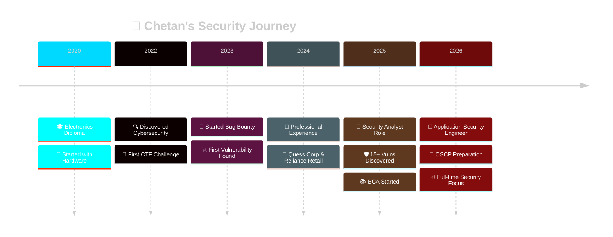
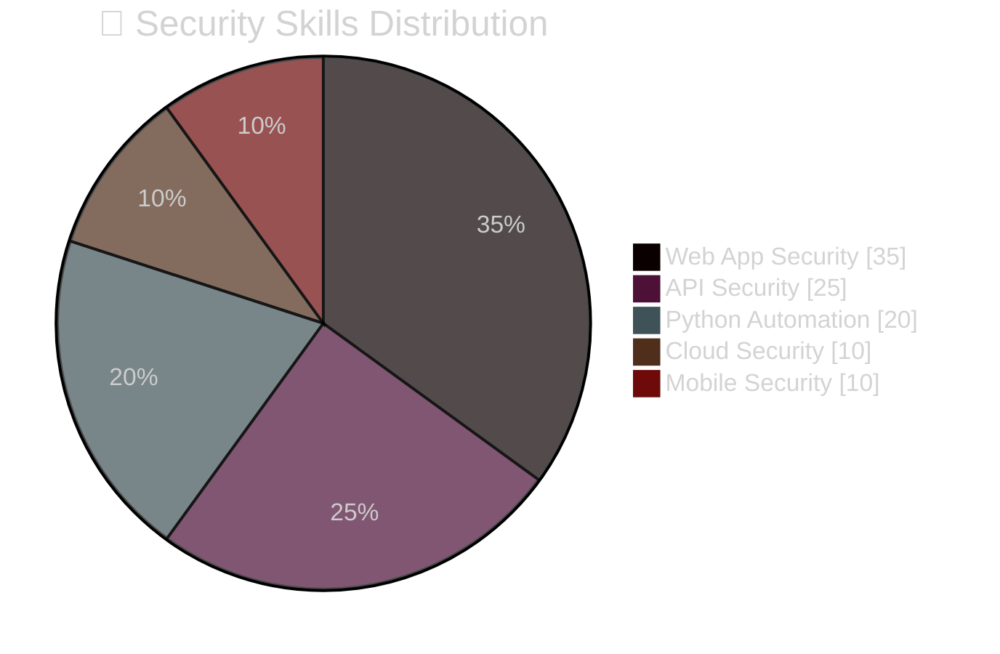
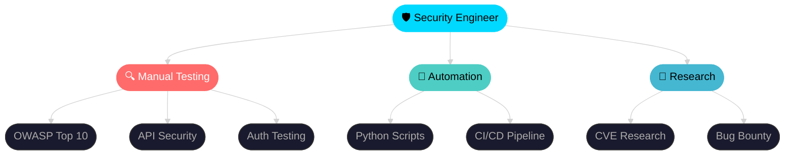

<div align="center">

<!-- ═══════════════════════ 3D HEADER ═══════════════════════ -->


<!-- ═══════════════════════ 3D TYPING ═══════════════════════ -->


<br/>

[](https://linkedin.com/in/chetanbiranje)
[](https://github.com/ChetanBiranje)
[](mailto:chetanbiranje@proton.me)
[](https://twitter.com/ChetanBiranje)
[](https://tryhackme.com/p/chetanbiranje)

<br/>


</div>

---

<div align="center">

```
 ██████╗██╗  ██╗███████╗████████╗ █████╗ ███╗   ██╗    ██████╗ ██╗██████╗  █████╗ ███╗   ██╗     ██╗███████╗
██╔════╝██║  ██║██╔════╝╚══██╔══╝██╔══██╗████╗  ██║    ██╔══██╗██║██╔══██╗██╔══██╗████╗  ██║     ██║██╔════╝
██║     ███████║█████╗     ██║   ███████║██╔██╗ ██║    ██████╔╝██║██████╔╝███████║██╔██╗ ██║     ██║█████╗  
██║     ██╔══██║██╔══╝     ██║   ██╔══██║██║╚██╗██║    ██╔══██╗██║██╔══██╗██╔══██║██║╚██╗██║██   ██║██╔══╝  
╚██████╗██║  ██║███████╗   ██║   ██║  ██║██║ ╚████║    ██████╔╝██║██║  ██║██║  ██║██║ ╚████║╚█████╔╝███████╗
 ╚═════╝╚═╝  ╚═╝╚══════╝   ╚═╝   ╚═╝  ╚═╝╚═╝  ╚═══╝    ╚═════╝ ╚═╝╚═╝  ╚═╝╚═╝  ╚═╝╚═╝  ╚═══╝ ╚════╝ ╚══════╝
```

</div>

---

##  About Me


```python
#!/usr/bin/env python3
# ═══════════════════════════════════════════
#   CHETAN BIRANJE — Application Security
# ═══════════════════════════════════════════

class SecurityEngineer:
    name     = "Chetan Biranje"
    role     = "Application Security Engineer"
    location = "Pune, Maharashtra 🇮🇳"
    company  = "ai4sees private ltd"

    skills = {
        "offensive"  : ["Manual PenTest", "OWASP Top 10",
                        "IDOR", "JWT Attacks", "API Security"],
        "automation" : ["Python", "Bash", "Nuclei", "CI/CD"],
        "platforms"  : ["HackerOne", "Bugcrowd", "Intigriti"],
        "certs"      : ["OSCP 🔴 In Progress",
                        "eJPT 🔵 Preparing",
                        "Security+ 🟢 Studying"],
    }

    impact = {
        "vulns_found"    : "15+  critical",
        "users_protected": "5000+",
        "remediation"    : "95%  success rate",
        "efficiency"     : "+30% via automation",
    }

    motto = "Making the internet safer, one vuln at a time 🛡️"

me = SecurityEngineer()
```

<br clear="right"/>

---

##  **Tech Stack - My Arsenal**

<div align="center">

### 🔒 **Security Testing Tools**

<br/>


### 💻 **Programming & Scripting**

<br/>


### 🌐 **Web Development & APIs**

<br/>


### ☁️ **Cloud & DevSecOps**

<br/>


</div>
---

## 📊 GitHub Statistics

<div align="center">


<br/>


<br/>


<br/>


<br/>


</div>

---

## 🏆 Trophy Showcase

<div align="center">


</div>

---

## 💥 Impact Metrics

<div align="center">

<table>
<tr>
<td align="center" width="180">
<br/>
<br/>
<b>Discovered</b>
</td>
<td align="center" width="180">
<br/>
<br/>
<b>Protected</b>
</td>
<td align="center" width="180">
<br/>
<br/>
<b>Success Rate</b>
</td>
<td align="center" width="180">
<br/>
<br/>
<b>Boost</b>
</td>
</tr>
<tr>
<td align="center">
<br/>
<br/>
<b>Automation</b>
</td>
<td align="center">
<br/>
<br/>
<b>TryHackMe</b>
</td>
<td align="center">
<br/>
<br/>
<b>HackTheBox</b>
</td>
<td align="center">
<br/>
<br/>
<b>PortSwigger</b>
</td>
</tr>
</table>

</div>

---

## 🚀 Featured Projects

<div align="center">

<a href="https://github.com/ChetanBiranje/365DaysOfApplicationSecurity">
  
</a>
<a href="https://github.com/ChetanBiranje/api-security-toolkit">
  
</a>

<br/>

<a href="https://github.com/ChetanBiranje/bug-bounty-toolkit">
  
</a>
<a href="https://github.com/ChetanBiranje/webapp-pentest-framework">
  
</a>

</div>

<details>
<summary><b>🎓 365 Days of Application Security — Details</b></summary><br/>

```yaml
Type    : Educational Roadmap
Goal    : Beginner → AppSec Engineer in 365 days
Topics  : OWASP Top 10, API Hacking, Auth Testing,
          Bug Bounty, OSCP Prep, CTF Writeups
Impact  : 100+ aspiring security engineers helped
Status  : ⭐ Growing daily
```

</details>

<details>
<summary><b>🛡️ API Security Automation Toolkit — Details</b></summary><br/>

```yaml
Type    : Python Framework
Goal    : Automate REST/GraphQL API Security Testing
Features: JWT Analysis, IDOR Scanner, API Fuzzer,
          Auth/Authz Testing, CI/CD Integration
Impact  : 30% reduction in manual testing time
Detects : OWASP API Top 10
```

</details>

<details>
<summary><b>🐛 Bug Bounty Toolkit — Details</b></summary><br/>

```yaml
Type    : Full Automation Framework
Stack   : Python + Bash + Nuclei
Features: Recon, Scan, XSS/SQLi/SSRF/IDOR Detection,
          HTML Reports, Slack/Discord Notifications
Use Case: HackerOne, Bugcrowd, Intigriti Programs
```

</details>

---

## 💼 Security Journey Timeline

<div align="center">



</div>

---

## 🎯 Current Focus (2026)

<div align="center">

| Skill | Progress |
|:------|:---------|
| 🔐 OSCP Preparation |  |
| 🐛 Bug Bounty Hunting |  |
| 💚 Open Source |  |
| 🔬 API Security Research |  |
| 🐍 Python Automation |  |
| ☁️ Cloud Security |  |

### 🎯 2026 Goals Tracker

| Goal | Status | ETA |
|:-----|:------:|:---:|
| 🏆 OSCP Certification |  | Q2 2026 |
| 💼 FAANG Security Role |  | Q3 2026 |
| ⭐ 1000+ GitHub Stars |  | Dec 2026 |
| 📝 Security Research Paper |  | Q4 2026 |
| 🐛 100+ Bug Bounties |  | Ongoing |
| 📚 10+ OSS Contributions |  | Dec 2026 |

</div>

---

## 🎓 Certifications & Platforms

<div align="center">


<br/><br/>

<table>
<tr>
<td align="center" width="220">
<a href="https://tryhackme.com/p/chetanbiranje">
<br/>

</a>
</td>
<td align="center" width="220">
<br/>

</td>
<td align="center" width="220">
<br/>

</td>
<td align="center" width="220">
<br/>

</td>
</tr>
</table>

</div>

---

## 📈 Contribution Heatmap

<div align="center">


</div>

---

## 🎨 Skills Distribution

<div align="center">





</div>

---

## 💡 Security Philosophy

<div align="center">

```python
#!/usr/bin/env python3

class SecurityPhilosophy:
    """
    ╔══════════════════════════════════════════════════════╗
    ║         My Core Security Principles                  ║
    ╚══════════════════════════════════════════════════════╝
    """
    ethics = [
        "🔐 Always test with explicit permission",
        "🤝 Responsible disclosure, every time",
        "💚 Protect users, not exploit them",
        "📚 Share knowledge freely with the community",
    ]

    methodology = [
        "🔍 RECON    → Thorough attack surface mapping",
        "🧪 TEST     → Systematic, creative testing",
        "📝 DOCUMENT → Clear, reproducible PoCs",
        "✅ VERIFY   → Confirm impact before reporting",
        "🛠️ FIX      → Practical remediation guidance",
    ]

    motto = """
    ╔═══════════════════════════════════════════════════════╗
    ║                                                       ║
    ║  "Security is not a product, but a process."          ║
    ║                                                       ║
    ║   Making the digital world safer —                    ║
    ║   one vulnerability at a time! 🛡️                    ║
    ║                                                       ║
    ╚═══════════════════════════════════════════════════════╝
    """
```

</div>

---

## 🌟 Testimonials

<div align="center">

> *"Chetan's ability to find critical vulnerabilities and communicate them effectively to our dev team was exceptional. His 95% remediation rate speaks volumes."*
> **— Security Team Lead, Codec Technologies**

> *"Outstanding Python automation skills. Reduced our manual testing time by 30% with his custom tools."*
> **— CTO, ai4sees private ltd**

> *"Discovered a critical IDOR affecting 5,000+ users. Clear PoC and remediation guidance. Excellent work!"*
> **— Bug Bounty Program Manager**

</div>

---

## 🎮 Fun Facts

<div align="center">

<table>
<tr>
<td align="center" width="180">☕<br/><b>Coffee Lover</b><br/><sub>Debugging on caffeine</sub></td>
<td align="center" width="180">🚩<br/><b>CTF Addict</b><br/><sub>Weekend warrior</sub></td>
<td align="center" width="180">💚<br/><b>Open Source</b><br/><sub>Contributing daily</sub></td>
<td align="center" width="180">📚<br/><b>Lifelong Learner</b><br/><sub>New skill every day</sub></td>
</tr>
</table>

</div>

---

## 🤝 Let's Connect

<div align="center">

```diff
+ OPEN TO:
! Application Security Engineer roles
! Security Consulting & Freelance projects
! Bug Bounty Collaborations
! Open Source Contributions
! Mentorship & Technical Workshops
```

[](https://linkedin.com/in/chetanbiranje)
[](mailto:chetanbiranje@proton.me)
[](https://github.com/ChetanBiranje)

<br/>

[](https://www.buymeacoffee.com/chetanbiranje)
[](https://github.com/sponsors/ChetanBiranje)

</div>

---

<!-- Snake Animation -->
<div align="center">

<picture>
  <source media="(prefers-color-scheme: dark)" srcset="https://raw.githubusercontent.com/ChetanBiranje/ChetanBiranje/output/github-contribution-grid-snake-dark.svg" />
  <source media="(prefers-color-scheme: light)" srcset="https://raw.githubusercontent.com/ChetanBiranje/ChetanBiranje/output/github-contribution-grid-snake.svg" />
  
</picture>

</div>

---

<!-- Footer -->
<div align="center">


**Last Updated:** February 2026 🕐 | **Made with** ❤️ **and lots of** ☕ **in Pune, India 🇮🇳**

</div>
